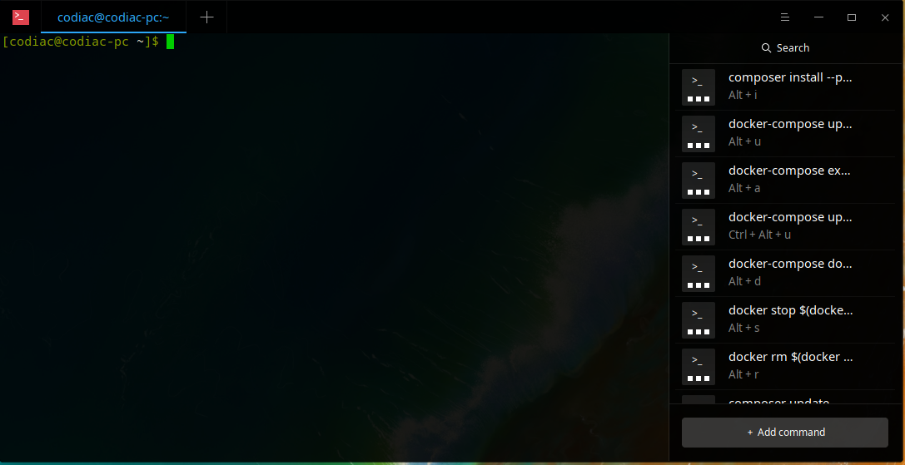
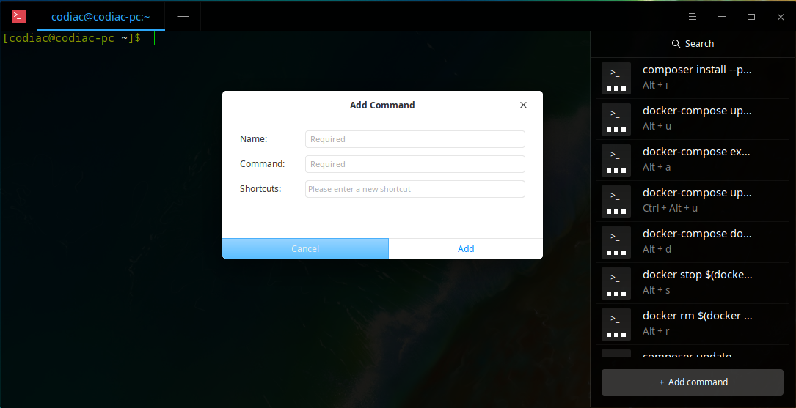
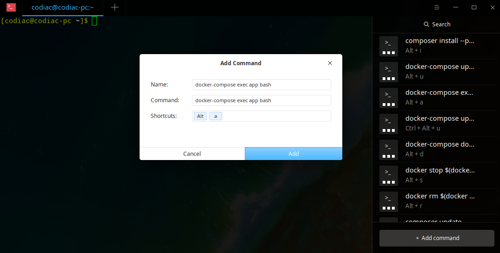

# Setup Deepin Terminal for Development

## Custom Commands

| COMMAND                                                | NAME                                                   | SHORTCUT        |
| ------------------------------------------------------ | ------------------------------------------------------ | --------------- |
| docker-compose exec app bash                           | docker-compose exec app bash                           | Alt + a         |
| docker-compose up -d                                   | docker-compose up -d                                   | Alt + u         |
| composer install --prefer-dist --no-progress --profile | composer install --prefer-dist --no-progress --profile | Alt + i         |
| docker-compose up -d --build                           | docker-compose up -d --build                           | Ctl + Alt + u   |
| docker-compose down                                    | docker-compose down                                    | Alt + d         |
| docker stop $(docker ps --all -q)                      | docker stop $(docker ps --all -q)                      | Alt + s         |
| docker rm $(docker ps --all -q)                        | docker rm $(docker ps --all -q)                        | Alt + r         |
| composer update --prefer-dist --no-progress --profile  | composer update --prefer-dist --no-progress --profile  | Ctl + Alt + i   |
| composer dump-autoload --verbose                       | composer dump-autoload --verbose                       | Ctl + shift + d |
| chown -R www-data:www-data . /en                       | chown -R www-data:www-data . /en                       | Alt + w         |

## Steps

1. Access Terminal Ctl+Alt+T

2. Click on the fourth icon from the left to custom commands.

   

3. Click on custom commands.

4. If no custom commands are added they will not list any of the commands as shown above.

5. Add a new command on clicking on "+ Add command".

   

6. Enter the name as "docker-compose exec app bash".

7. Enter the command "docker-compose exec app bash"

8. Enter the shortcut by using keys "ALT+A"

   

9. Then click on Add. 

10. Similarly add other commands as showed in the table.

