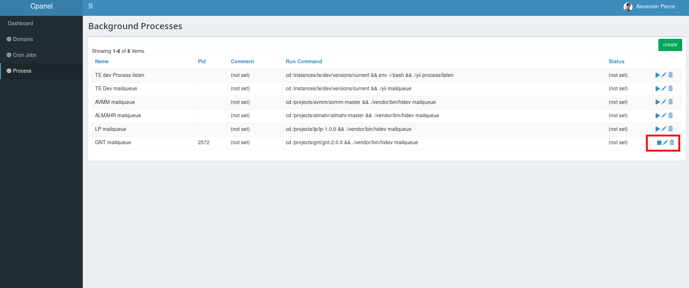

**CPANEL**
========

**[Introduction](#Introduction)**

**[Authentication](#Authentication)**

**[Manage Cron Jobs](#Manage Cron Jobs)**

**[Manage Background Process](#Manage Background Process)**

**Introduction**

Cpanel is used to manage Cron Jobs and Background processes of a project.

The Cron Jobs include the jobs that run in daily, every minute, every five minutes,  hourly and last run. 

The Background processes include the processes that are to be run in a project in background. Such a process is mail-queue. There can be other types of processes regarding the project.

**Authentication**

First and foremost to Manage Cpanel in Local, Follow the steps:

1. Access http://cpanel.yii/auth/account/login

2. Enter user name as "admin"

3. Enter password as "admin" and sign in

   

**Manage Cron Jobs**

1. Access http://cpanel.yii/cron.

   

2. Click on "create" button(green) on the upper right most corner.

    

3. Enter the name of the Cron Job.

4. The Cron Jobs vary in Run time. Specify the run time as per requirement.

        a)every minute and last run : *****
        b)every five minute :*/5****
        c)hourly : 0****
        d)daily : 10***

5. The next field required to be filled is Run command. This is the instance from the current version of the project followed by the cron job respectively.

**Manage Background Process**

1. Access http://cpanel.yii/process.

   

2. Click on "create" button(green) on the upper right most corner.

   

3. Enter the Name and Run Command where name specified should be the name of the background process and Run command should be the project current instance of version followed by the process.

4. Then create the process.

5. The created process appears in the http://cpanel.yii/process.

6. These processes are provided with options to run,edit and delete.

7. The process works in the project only if we run the background process.

   

8. We can similarly stop the process run on clicking on the stop.

9. We can edit and delete the process upon requirement using edit and delete options provided. 
